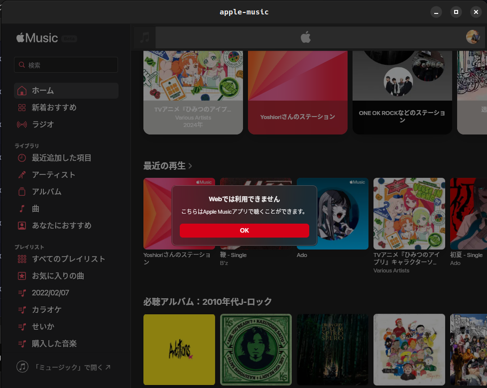

# apple-music
=======

The page was displayed, but the music didn’t play, so this project is over.

This template should help get you started developing with Tauri in vanilla HTML, CSS and Typescript.
